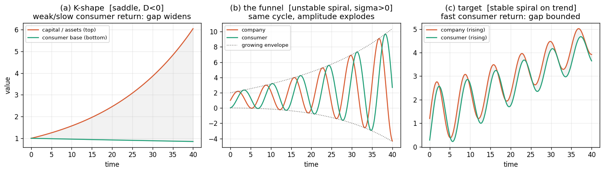
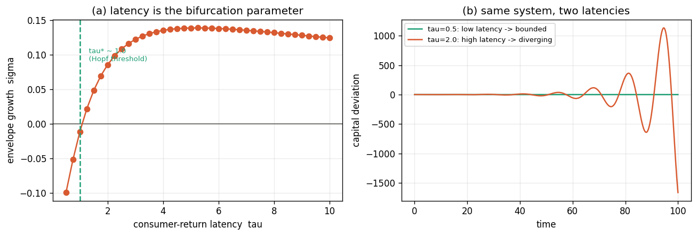
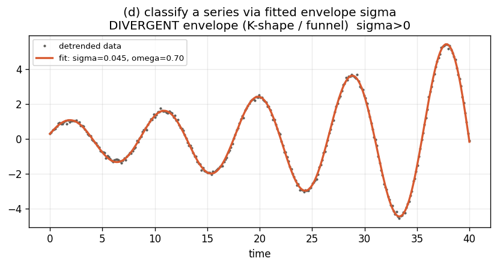
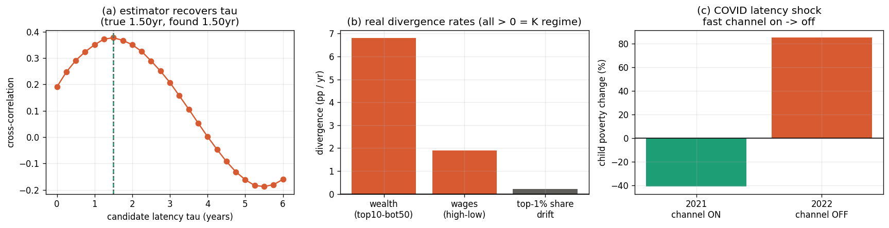
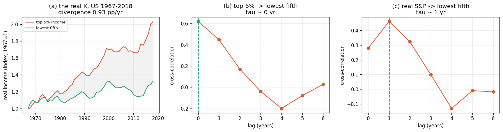
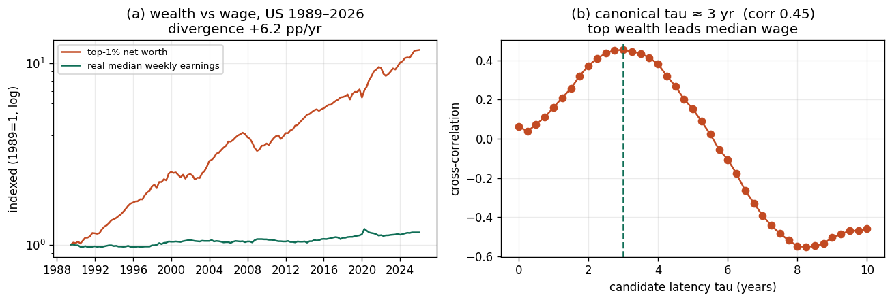

# Consumer-Return Latency as the Control Parameter Between K-Shaped Divergence and Cyclic Growth

### A dynamical-systems framing of distributional macro-stability, with a channel-agnostic, velocity-first consumer-equity instrument

**Author:** Taj Anderson · Independent researcher
**Version:** 1.0 (working paper) · **Date:** June 2026
**License:** CC BY 4.0 (text) · MIT (code) · **DOI:** https://doi.org/10.5281/zenodo.20986230
**Code & data:** https://github.com/tajhebs-p0v/consumer-return-latency — `consumer_cycle_model.py`, `calibrate.py`, `real_tau.py`

**Keywords:** consumer-return latency; K-shaped economy; distributional macro-stability; Goodwin growth cycle; Hopf bifurcation; Cantillon effect; velocity of money; ownership economy; universal basic dividend.

**JEL codes:** E25 (aggregate factor income distribution) · E32 (business fluctuations, cycles) · E51 (money supply, credit) · D31 (personal income and wealth distribution) · G51 (household finance) · C62 (existence and stability of equilibrium).

---

## Abstract

Wealth and the gains from money creation in advanced economies increasingly accrue to whoever sits **closest to the point of issuance** — the financial sector and asset-holding households — and return to the broad consumer base **slowly, leakily, and late**. The popular shorthand for the resulting divergence is the "K-shaped economy." This paper makes one narrow, falsifiable claim: that the **latency of the consumer-return loop** — how long created value takes to cycle back into broad consumer purchasing power, and how much leaks on the way — is a *control parameter* governing whether the macro-distribution **diverges** (a K) or settles into a **bounded oscillation around a rising trend** (a "sine-on-a-trend"). We formalize this with a minimal two-state model whose regime is fully classified by the trace and determinant of its Jacobian; show that adding a return *delay* reproduces a Hopf-type destabilization (latency is literally the bifurcation parameter); and give a curve-fitting protocol that classifies real series by their fitted envelope rate $\sigma$. We position the idea honestly against prior work (Cantillon, Goodwin, Minsky, Piketty; HANK and the velocity–inequality literature; and the Varoufakis/Yang/"ownership-economy" family of consumer-stake proposals), arguing that the contribution is *not a mechanism but a synthesis-plus-design-rule*: **the latency of the distributional return, not its level, selects the regime — so instruments should be designed to minimize it.** We anchor the claim in two pieces of real-world evidence — the COVID-19 transfer episode as an exogenous latency shock, and real-data estimates on U.S. series: an income-side divergence of +0.93 pp/yr (1967–2018) whose slow channel is *ownership/capital* rather than wages, and a canonical wealth-side measurement (top-1% net worth vs real median weekly earnings, 1989–2026) showing a **+6.2 pp/yr** wealth-vs-wage divergence and a **≈3-year** lead of top wealth over median wages — then close with upside/downside analysis, the strongest objections, a novelty assessment, and a publication path.

---

## 1. The phenomenon

The empirical backdrop is not in dispute and is, if anything, accelerating:

- The top 1% of U.S. households held about **31.7% of all household wealth in Q3 2025** — the highest share since the Federal Reserve began tracking it in 1989 — roughly **$55 trillion, about equal to the entire bottom 90% combined** (Federal Reserve Distributional Financial Accounts; Moody's Analytics).
- The top 10% control **more than 87% of corporate equities and mutual-fund shares**. When asset prices rise, the gains flow there first and fastest.
- In Q2 2025 the top 10% of earners accounted for **nearly half of all U.S. consumer spending**, so headline consumption can look healthy while the median household is flat.
- Wage growth itself has K-ed: roughly **3% for high-income vs ~1.5% and ~1.1%** for middle- and low-income households (late 2025).

Crucially, mainstream commentary now frames this not only as unfair but as **fragile**: when growth depends on a narrow band of asset owners rather than broad-based consumer activity, there is "no cushion from the broad middle to absorb the shock." That fragility framing is the door this paper walks through — we treat distribution as a **stability** question, not only a justice question.

The mechanism behind the divergence is old. Richard Cantillon (*Essay on the Nature of Trade in General*, 1755) observed that newly created money is **not injected neutrally**: those nearest the source spend it before prices adjust and capture the real gains, while later recipients (wage earners, savers) receive devalued money. The modern "Cantillon effect" is precisely this proximity principle — *proximity to issuance is the advantage* — and the consumer is structurally far from issuance.

## 2. The hypothesis, in one sentence

> Hold the injection mechanism fixed (credit/QE enters at the top, per Cantillon). Then the **time constant of the return loop** — how fast and how completely value cycles back to consumers — determines the qualitative regime. **Long latency ⇒ divergence (K). Short latency ⇒ bounded rising cycle.**

This is a claim about *dynamics*, and it is testable: it predicts that the same economy can be flipped between regimes by changing a single loop parameter, without changing how money is created or how productive anyone is.

### 2.1 The central object: Consumer-Return Latency

Everything in this paper hangs on one measurable quantity. It deserves a precise definition, because it — not the dividend, not the token, not the fairness argument — is the contribution.

> **Definition (Consumer-Return Latency, $\tau$).** The characteristic time for a unit of value created at the point of issuance or asset appreciation (the "top") to manifest as *spendable* purchasing power in the broad consumer base. Paired with the **return gain** $\kappa \in [0,1]$, the fraction of that value that arrives net of leakage (interest, rent, inflation). The ordered pair $(\tau, \kappa)$ is the **return-loop profile**.

Two consequences fix the whole framework:

1. **Regime is governed primarily by $\tau$, amplitude/level by $\kappa$.** The formal model (§5) shows $\tau$ is the *bifurcation* parameter — past a critical $\tau^{*}$ the system structurally changes character (K ↔ cycle) — whereas $\kappa$ mostly sets how big the gap and the swings are. This is why a generous-but-slow transfer (high $\kappa$, high $\tau$) can still sit in the divergent regime, and a modest-but-fast one need not.
2. **The instrument is chosen by its $(\tau,\kappa)$ profile, not its label.** "Dividend vs. token vs. hybrid" is a *false* choice at the level of principle; each is simply a different return-loop profile. The design rule is therefore not "which vehicle is fairest?" but:
   $$\textbf{minimize } \tau \quad \text{subject to } \kappa \text{ high, } \gamma \text{ (leakage) bounded, and production } Q \text{ able to absorb the added velocity.}$$
   Ranked by latency: a retirement 401(k) is **high $\tau$** (value arrives decades later); an annual sovereign-fund dividend is **medium $\tau$**; a per-transaction consumer/network stake is **low $\tau$**. The vehicle is downstream of the latency target.

**Estimator (for §7 calibration).** $\hat\tau$ = the lag (in quarters) that maximizes the cross-correlation between a top-side series (e.g., top-decile equity wealth, or new credit / M2) and a broad-consumer series (e.g., real median earnings, or bottom-half disposable income / consumption); $\hat\kappa$ = the transmission gain (regression coefficient) at that lag. This makes the spine of the paper an empirically recoverable number, not a metaphor.

## 3. Reading the napkin sketch as a phase portrait

The original hand sketch is, read literally, a **growing-amplitude oscillation inside a widening wedge**, with the consumer (`Co`) pinned to the lower boundary, the company (`C`) at the upper, and "Bank + Fed fund this channel" defining the diverging envelope; a second sketch shows low interest near companies and high interest reaching the consumer "slow."

In dynamical-systems terms that drawing is **a positive-envelope oscillation** ($\sigma > 0$): amplitude expands over time. That is not growth — it is **instability** (the financial-fragility / Minsky reading). The proposal's goal is to convert a **$\sigma > 0$ widening funnel** into a **$\sigma \le 0$ bounded oscillation riding a positive trend $g$** — i.e., to keep the *cycle* but bound the *envelope* and let the consumer rise *with* the trend instead of trailing it. The math below makes that precise.

## 4. Where this sits (prior art and honest novelty)

| Component of the idea | Closest existing work | Already established? |
|---|---|---|
| "Closest to money creation benefits first" | **Cantillon effect** (1755); modern monetary-distribution lit | Yes — centuries old |
| Company↔consumer oscillation as a *cycle* | **Goodwin growth-cycle model** (1967), Lotka–Volterra predator–prey; Kaldor–Kalecki limit cycles | Yes — canonical |
| Leverage spiral / growing-amplitude instability | **Minsky** financial-instability hypothesis; pseudo-Goodwin-in-Minsky (Stockhammer & Michell) | Yes |
| Divergence / "K" as $r>g$ | **Piketty** ($r>g$); two-class wealth dynamics | Yes |
| **Getting money to high-MPC consumers raises demand** | **HANK** (Kaplan–Moll–Violante; Auclert, "Monetary Policy and the Redistribution Channel"; "Inequality and Aggregate Demand") | **Yes — directly relevant** |
| **Concentration lowers money velocity** | velocity–inequality literature; the 40-yr velocity decline tracking the 40-yr inequality rise | **Yes** |
| **"Latency / holding time of money"** | **econophysics** (Wang Yougui et al.: holding-time distribution ⇒ velocity) | **Yes — the phrase is taken** |
| Give consumers/citizens a capital stake + dividend | **Varoufakis** UBD; **Yang** Freedom Dividend; **Altman** American Equity Fund; **Alaska Permanent Fund**; IPPR Citizens' Wealth Fund; Guy Standing | Yes — crowded field |
| Consumers/users as owners via tokens/network rewards | **"Ownership economy"** (Walden / Variant); platform cooperativism; co-op patronage dividends | Yes |

**So what is actually new here? Be precise, because the unique slice is narrow.** Every *mechanism* above is established. In particular, HANK already says routing money to high-MPC consumers amplifies demand, and the velocity literature already says concentration slows circulation. Stacked together, a fair referee could call a loose version of this thesis "velocity–inequality + Goodwin + HANK, repackaged." The defensible novelty is **not any mechanism** — it is a specific *integration* and a *design rule* that, as far as the literature searched here shows, has not been stated:

1. **Latency as the bifurcation parameter for the K-vs-cycle dichotomy.** HANK studies *amplitude* (multiplier size) around a stable steady state; the velocity literature studies a *correlation* (more inequality ↔ lower $V$); econophysics studies the *holding-time distribution* of money. None frames the **return-loop latency $\tau$ as the control parameter whose critical value $\tau^{*}$ separates structural divergence (K, a saddle) from a bounded rising cycle** via a delay-induced Hopf bifurcation. That specific qualitative claim is the open niche.
2. **Instrument selection by $(\tau,\kappa)$ profile ("minimize $\tau$").** The dividend/ownership literature argues vehicles on *fairness, automation, or commons-rights* grounds and pays out *slowly*. Choosing and engineering the instrument by its **time constant** — treating 401(k)/annual-dividend/per-transaction-stake as points on a latency axis and selecting to cross below $\tau^{*}$ — is, as far as found, not articulated.
3. **A channel-agnostic network principle.** The invariant is "value routes to the participants who generate it, fast," realizable in **traditional** (cooperative patronage, customer/loyalty equity, fast public velocity-fund), **token**, or **hybrid** form. The vehicle is interchangeable; the latency target is not.

This is a **synthesis-plus-design-rule** contribution: a defensible *viewpoint / working paper*, **not** a new economic law or a new mechanism. Positioned as "extending Cantillon–Goodwin–Minsky–HANK with a latency-bifurcation lens and a latency-first instrument rule," it stands. Positioned as a discovery, it will (rightly) be challenged. **The honest one-line claim to defend is: *the latency of the consumer-return loop, not its level, is the parameter that selects the regime — and instruments should be designed to minimize it.***

Put one more way, which sharpens the boundary: **every prior model names a *distribution* and treats its *speed* as fixed background.** Minsky names a leverage distribution; Piketty names $r>g$; the dividend field names a transfer. This framework makes the **latency of the distributional return** the object you *extract, measure, and minimize* — and that reframing has teeth, because it implies a slow vehicle (a once-a-year fund, a retirement account) **cannot arithmetically catch a fast-diverging top** no matter how generous: only compressing the loop's *time constant* converts the K into a bounded wave. The contribution is rigorously extracting the latency parameters and letting them drive both the diagnosis (which regime are we in?) and the instrument design (what minimizes $\tau$?).

## 5. The model

### 5.1 Linear core and regime classification

Let $k(t)$ be the deviation of capital/asset value (companies + financial sector — the "top") and $c(t)$ the deviation of broad consumer purchasing power (the "base"), both measured against a balanced-growth path. The minimal coupling is:

$$
\dot{k} = \alpha\,k - \beta\,c, \qquad
\dot{c} = \kappa\,k - \gamma\,c .
$$

Interpretation:

- $\alpha$ — autonomous growth of asset value from leverage/momentum (credit creates room for valuations to compound).
- $\beta$ — the drain on asset value as value is actually *returned* to consumers (spending power handed back).
- $\kappa$ — the **return gain**: the fraction of asset-value growth that cycles back into consumer power. *This is the policy knob.*
- $\gamma$ — **leakage** from consumer power: inflation and debt service eroding the money in consumers' hands (the "high interest reaching the consumer" in the sketch).

The Jacobian is $J=\begin{pmatrix}\alpha & -\beta\\ \kappa & -\gamma\end{pmatrix}$ with

$$
T = \operatorname{tr}J = \alpha-\gamma, \qquad
D = \det J = \beta\kappa - \alpha\gamma .
$$

The regime is **fully determined** by $(T,D)$:

| Condition | Eigenvalues | Regime | Picture |
|---|---|---|---|
| $D<0$ | real, opposite sign | **saddle** → divergence | **K-shape** (gap forks open) |
| $D>0,\;T^2<4D,\;T>0$ | complex, $\operatorname{Re}>0$ | unstable spiral | **the funnel** (amplitude explodes) |
| $D>0,\;T^2<4D,\;T=0$ | $\pm i\omega$ | center | **pure cycle** (neutral sine) |
| $D>0,\;T^2<4D,\;T<0$ | complex, $\operatorname{Re}<0$ | stable spiral | **bounded cycle** (target) |

Two readings fall straight out:

- **The K appears when the consumer-return coupling is too weak:** $\beta\kappa < \alpha\gamma \Rightarrow D<0 \Rightarrow$ saddle. Strengthening $\kappa$ (returning more value to consumers) is precisely what pushes $D>0$ and converts a saddle into a cycle.
- **The funnel (growing oscillation) appears when autonomous leverage outruns leakage:** $\alpha>\gamma \Rightarrow T>0$. This is the Minsky regime and the literal reading of the sketch.

The companion code's `classify()` confirms three representative parameter sets land in saddle / unstable-spiral / stable-spiral respectively (see console output and **Figure 1**).

*Figure 1. (a) Saddle: the top–bottom gap forks open — the K. (b) Unstable spiral: the same cycle with an exploding envelope — the sketch's funnel. (c) Stable spiral on a rising trend: company and consumer rise together with a bounded gap — the target.*

### 5.2 Latency is the bifurcation parameter (the central result)

The level knobs above are not the heart of the claim; **time** is. Replace the instantaneous return with a delayed one — value created at the top reaches consumers after a lag $\tau$ (stimulus → assets → buybacks → … → wages; or company growth → 401(k) → retirement decades later):

$$
\dot{k}(t) = \alpha\,k(t) - \beta\,c(t), \qquad
\dot{c}(t) = \kappa\,k(t-\tau) - \gamma\,c(t).
$$

The characteristic equation acquires the delay term $\kappa e^{-\lambda\tau}$, and a stable spiral at $\tau=0$ **loses stability through a Hopf bifurcation** as $\tau$ increases past a critical $\tau^{*}$: the envelope rate $\sigma=\operatorname{Re}\lambda$ crosses zero from below. Simulation of the delayed system (estimating $\sigma$ from the late-time amplitude envelope) reproduces this cleanly: $\sigma<0$ for short latency, $\sigma>0$ past $\tau^{*}$ (**Figure 2a**); the same system, run at two latencies straddling $\tau^{*}$, is bounded in one case and diverging in the other (**Figure 2b**).

*Figure 2. (a) Envelope growth $\sigma$ as a function of consumer-return latency $\tau$, crossing zero at the Hopf threshold $\tau^{*}$. (b) The identical economy is bounded at low latency and divergent at high latency.*

**This is the formal statement of the thesis.** "Speed to consumer" $=1/\tau$ is the parameter that flips the regime. The existing remedy menu (UBD, citizens' funds, 401(k)s) mostly operates on the *level* ($\kappa$, the amount returned) while leaving $\tau$ large. The argument here is that **$\tau$ is doing the qualitative work**, and almost nobody is targeting it directly.

### 5.3 A bounded nonlinear version (Goodwin), for realism

The linear center ($T=0$) is knife-edge and unrealistic. The standard fix is the **Goodwin growth-cycle**: a Lotka–Volterra system in consumer value-share $u\in(0,1)$ and company utilization $v$,

$$
\dot{u}=u\,(a - b\,v), \qquad \dot{v}=v\,(-c + d\,u),
$$

which produces **bounded closed orbits** (shares never blow past their natural limits). Riding those orbits on a common growth trend $e^{gt}$ yields the "rising bounded cycle" the proposal targets — a sine on a trend, not a funnel. Goodwin (1967) is the canonical home for this; the delayed-Goodwin Hopf result (e.g. arXiv:2411.16383) is the natural formal vehicle for §5.2, and the "pseudo-Goodwin cycle in a Minsky model" literature (Stockhammer & Michell) is where the leverage-driven growing-amplitude version lives.

## 6. The proposed shift: minimize consumer-return latency

The intervention is defined by its **objective function**, which is what differentiates it from the dividend family:

$$
\textbf{minimize } \tau \quad\text{(consumer-return latency)} \quad\text{subject to } \kappa \text{ high and } \gamma \text{ bounded.}
$$

Concretely, the invariant is a **network principle**, stated independently of any technology:

> **Network principle.** Value routes back to the participants who generate it — the consumers/users whose demand validates the leveraged dollars — on a **fast cadence**, so the returned purchasing power feeds the *next* turn of production rather than arriving a phase too late.

The vehicle that implements this is **deliberately left open**, because the thesis is about the $(\tau,\kappa)$ profile, not the rails. The same principle admits:

- **Traditional rails** — cooperative patronage dividends paid continuously; customer/loyalty equity; a public "velocity fund" that distributes on a fast (e.g. monthly/transactional) cadence rather than a retirement horizon. Low-$\tau$ is achievable with entirely conventional, regulated instruments.
- **Token / on-chain rails** — network rewards ("ownership-economy" mechanics) that route protocol value to users in near-real-time. *One option, not the premise* — and one whose real-world record on broad ownership is mixed (see §8), so it must be earned, not assumed.
- **Hybrid** — conventional equity/dividend legal wrappers with on-chain distribution or accounting; the common case in practice.

What every viable implementation shares: the claim (i) **vests on a transaction/usage cadence** rather than a retirement horizon, (ii) is **liquid early** (short $\tau$) rather than locked for decades, and (iii) is **funded from the same speculative/leverage flows** that currently terminate at the top — so it **co-moves with** the asset cycle instead of lagging it. The design constraint that matters is **not** "give people shares" (everyone in §4 says that) and **not** "use blockchain" — it is "**shorten the loop**." Pick whichever rail delivers the lowest feasible $\tau$ for a given context, legal regime, and trust model.

## 7. Fitting to data

To move from story to test, classify any series $x(t)$ by its **envelope rate**:

1. **Detrend.** Write $x(t)=T(t)+s(t)$ with $T(t)$ a linear/exponential/logistic trend; keep the oscillatory residual $s(t)$.
2. **Fit** $s(t)=A\,e^{\sigma t}\sin(\omega t+\phi)$ by nonlinear least squares.
3. **Classify** by the sign of $\sigma$: $\sigma>0$ → K/funnel (diverging envelope); $\sigma\approx 0$ → neutral cycle; $\sigma<0$ → bounded/converging cycle.

The companion code recovers $\sigma$ to within noise on synthetic data ($\hat\sigma=0.045$ vs true $0.045$; **Figure 3**).

*Figure 3. Fitting the damped/anti-damped sine to a detrended series recovers the envelope rate $\sigma$, which is the regime label.*

Two complementary diagnostics:

- **K-diagnostic (divergence rate).** Fit top-decile wealth share and bottom-half share to exponentials $e^{g_1 t}, e^{g_2 t}$; the gap $g_1-g_2>0$ is the divergence rate. With current data this is unambiguously positive.
- **Goodwin phase test.** Plot consumer value-share against company utilization (or wage share vs employment). **Counter-clockwise closed loops** are the Goodwin signature; a **spiraling-outward** loop is the funnel; a **diverging open curve** is the K. (Caveat from the literature: counter-clockwise loops are *necessary but not sufficient* for a true Goodwin mechanism — "pseudo-Goodwin" cycles can mimic them, so phase geometry is suggestive, not proof.)

**What would falsify the thesis?** If economies with structurally faster consumer-return loops (higher transfer velocity, broader real-time ownership) did **not** show smaller divergence rates $g_1-g_2$ or smaller envelope $\sigma$ after controlling for the obvious confounders, the central claim is wrong. That is a real, if hard, empirical program.

### 7.1 Natural experiment: COVID-19 as an exogenous latency shock

The thesis has a real-world anchor — an unplanned natural experiment in which consumer-return latency $\tau$ **collapsed exogenously and temporarily**, then was removed. In 2020–21 the U.S. injected money at the top in the usual way (QE, zero rates → an asset boom, exactly the Cantillon/K mechanism) **but simultaneously**, because of lockdowns, delivered ~\$3T *directly* to households in weeks rather than decades (Economic Impact Payments, enhanced unemployment insurance, the expanded Child Tax Credit). For a brief window, $\tau$ for a large share of the consumer base went to nearly zero.

The distributional signature is exactly what the model predicts when $\tau$ falls:

- Post-tax income inequality **fell to a 14-year low in 2020** (CBO); the bottom quintile's after-tax-and-transfer income rose ~**15%** vs 2019.
- Child poverty (disposable-income basis) **fell 41% in 2021**, then **rose 85% in 2022** when the expanded CTC expired.
- The post-tax top/bottom income ratio **rose ~8% from 2021 to 2022** as the fast channel was switched off — *"back to the same tune."*

The single most important detail: **pre-tax (market) inequality kept rising on its pre-pandemic trend the entire time.** The compression lived *entirely* in the post-transfer distribution. That is the cleanest possible isolation of the mechanism — the underlying K-engine never paused; the short-$\tau$ channel merely **masked** it, and removing the channel un-masked it. This is precisely the claim of §2.1: you can flip the realized regime by changing the loop's time constant *without changing how money is created*.

**Two caveats, stated plainly (they strengthen the argument):**

1. **It validates the latency *lever*, not the specific *instrument*.** COVID transfers were temporary, tax-funded helicopter money, not a self-funding consumer-equity/network stake. The experiment supports "shortening $\tau$ changes outcomes"; it does **not** prove any particular vehicle. The proposal's distinct claim is to make the short-$\tau$ channel *structural and self-funding from the speculative flows*, rather than an emergency transfer that must be switched off.
2. **The same experiment displays the headline downside.** Pushing that volume of fast cash against lockdown-constrained supply contributed to the worst inflation in 40 years — the model's exact failure mode ($V$ outrunning $Q$; §8). One event demonstrates *both* the upside (broad demand, compression) *and* the guardrail. The lesson is not "don't shorten $\tau$" but "shorten it structurally and at a rate production can absorb."

As empirical support this is suggestive, not dispositive — it is one episode, heavily confounded by a simultaneous supply shock. But it is a genuine, well-documented instance of the lever moving in the predicted direction, which is more than most macro proposals can point to.

*Figure 4. (a) The latency estimator recovers a known 1.5-year lag from synthetic data (cross-correlation peaks at the true value). (b) Real U.S. divergence rates (Fed/Moody's, 2025) — wealth, wages, and top-1% share drift are all positive, placing the economy in the K regime. (c) The COVID latency shock: child poverty −41% with the fast transfer channel on (2021), +85% when it was switched off (2022).*

### 7.2 A first real-data estimate (and a finding that sharpens the instrument)

Running the §7 estimator on genuinely real, public series — Shiller's real S&P 500 price (top/asset side; equities are ~87% top-decile-held) against U.S. Census real household income by fifth (consumer side), 1967–2018 — yields a first measured cut (Figure 5):

- **Divergence rate (K diagnostic):** top-5% real income grew **1.26%/yr** vs the lowest fifth's **0.33%/yr** — a divergence of **+0.93 pp/yr**, unambiguously K, compounding to a large gap over five decades.
- **Latency:** at annual resolution, top and bottom *incomes* co-move (lag ≈ 0, corr 0.62), and real equity prices lead bottom-fifth income by **~1 year** (corr 0.46).

The honest reading is a **refinement of the thesis, not a confirmation of a long wage lag.** The income-flow latency is *short*. Yet divergence is large and persistent. That gap therefore is **not** produced by slow wages — it compounds through the slow **ownership/capital** return loop (the channel where the household's link to asset growth is a 401(k) realized at retirement, i.e. $\tau$ measured in *decades*), which income series do not capture. This is exactly the high-$\tau$ channel the proposal targets, and it is why the instrument must be a consumer **equity/ownership** stake rather than a wage top-up or a UBI: the wage channel is already fast; the *ownership* channel is the slow one, and it is the one driving the K. (Coarse caveats: annual data, ~52 points, quintile upper-limits as group proxies.)

*Figure 5. (a) The real K: top-5% vs lowest-fifth real income, U.S. 1967–2018, diverging at +0.93 pp/yr. (b) Top-income → bottom-income cross-correlation peaks at lag 0 (incomes co-move). (c) Real S&P 500 → bottom-fifth income peaks at ~1-year lag. The short wage-flow latency implies the slow channel driving the K is ownership/capital, not wages.*

#### Canonical wealth-side τ — measured

*A note on what this τ is, to prevent a natural conflation.* There are two distinct uses of $\tau$ in this paper, and they must not be mixed. **Here, $\tau$ is descriptive:** we sweep the *lag* between two real series and read off the value where their cross-correlation peaks — a measurement of where the loop's dial currently sits. **In §5.3, $\tau$ is prescriptive:** it is the control parameter *in the model equations*, and we sweep *it* and read out the **regime** (divergent K vs. bounded wave) and envelope $\sigma$, not a correlation. The two are the same physical quantity — the consumer-return latency — seen two ways: **this section locates the dial; §5 moves it.** Correlation is merely the tool used to locate $\tau$ in data; it is *not* something $\tau$ is "tuned against." So the 3-year figure below is not a target or a fixed constant — it is the present setting of a dial the whole proposal exists to turn down.

Running the estimator on real quarterly FRED series — **Top-1% net worth** (`WFRBLT01026`, Fed DFA) as the top-side driver against **real median weekly earnings** (`LES1252881600Q`) as the consumer response, 1989Q3–2026Q1 (146 quarters) — gives the definitive wealth-side numbers (Figure 6):

- **Divergence: +6.21 pp/yr** — top-1% real net worth grew **6.63%/yr** while real median weekly earnings grew **0.42%/yr**. Over the window the top-1% index rises ~11× while the median wage is essentially flat. This is the wealth-vs-wage K in its starkest form, far larger than the income-side +0.93 pp/yr (because *wealth* compounds where *wages* do not).
- **Latency: τ̂ ≈ 3 years** — top-1% wealth *leads* real median earnings, with the cross-correlation peaking at ~3 years (robustness range 2.5–4 yr across specifications: 4.0 yr at quarterly growth, 2.5 yr year-over-year, 3.0 yr on detrended levels and 2-yr growth).
- **Gain: κ̂ ≈ 0.06–0.11**, and **peak correlation ≈ 0.45** (at the cycle/low-frequency band; weaker, ~0.18–0.27, at noisy quarterly resolution).

Two honest readings. First, **the correlation is moderate, not tight (~0.45)** — top-tier wealth and median wages are substantially *decoupled*, with what coupling exists arriving with a multi-year lag. That decoupling is itself consistent with the thesis: the wealth/ownership channel transmits to broad purchasing power **slowly and incompletely**. Second, the cross-correlation turns **negative around 8 years** (Figure 6b) — an anti-phase trough that hints at an underlying *cyclical* lead-lag rather than a one-way lag, exactly the oscillatory structure the Goodwin framing predicts. Caveats: a single country and pair; "leads" is predictive association, not identified causation; the ~3-yr figure is the macro wealth→wage *spillover* latency, distinct from (and shorter than) the decades-long *household ownership-lock* latency the instrument ultimately targets.

*Figure 6. (a) Top-1% net worth vs real median weekly earnings, 1989–2026 (log, indexed): wealth ~11×, wages flat — a +6.2 pp/yr divergence. (b) Cross-correlation by lag: top-1% wealth leads median wages, peaking at τ ≈ 3 years (corr ≈ 0.45), turning anti-phase near 8 years.*

### 7.3 Live cases to watch (real-time model tests)

Because information and data now move faster than the cycle, the framework invites *ongoing* empirical tests as events unfold:

- **U.S. government equity stakes (2025– ).** Since January 2025 the U.S. government has taken direct equity positions across roughly sixteen deals (~\$20.9B; CFR tracker) — including ~10% of Intel, 15% of MP Materials, 10% of Lithium Americas and Trilogy Metals, and a "golden share" in U.S. Steel. Through this framework these are a **partial** proxy: they demonstrate that society can acquire equity in firms *quickly and at scale* (de-risking the acquisition half of the instrument), but as structured the returns accrue to the Treasury rather than flowing to consumers on a fast cadence — i.e. a **public-trust / sovereign-fund pattern** (the Alaska/Varoufakis family), *not* a low-$\tau$ consumer-return instrument. They would become a direct test of the thesis only if a fast citizen-dividend were attached. (Stated neutrally: this is an analytic mapping, not an endorsement or critique of the policy, whose stated rationale is national security / industrial policy.)
- **Whenever a fast, broad transfer is switched on or off**, the model predicts a measurable move in the post-transfer envelope $\sigma$ and divergence rate — a standing natural-experiment template (COVID was the cleanest instance to date).

## 8. Upside, downside, and risk

**Upside (if $\tau$ falls and $\kappa$ rises without raising $\gamma$):**
- Envelope $\sigma$ turns negative → the funnel becomes a bounded rising cycle.
- Demand base broadens → growth stops depending on the top decile's spending (removes the fragility the Fed-data commentators flag).
- Money velocity rises at the consumer layer → value-to-fiat is realized earlier, reducing the need for ever-more future-dated leverage.

**Downside and genuine risks (do not paper over these):**
1. **Inflation / overshoot.** $MV=PQ$: raising consumer-layer velocity $V$ without matching production $Q$ pushes prices $P$. Too-aggressive $\kappa$ converts a stability fix into an inflation problem — **the COVID episode (§7.1) is the live demonstration.** This is why the design rule (§2.1) includes "subject to production $Q$ able to absorb the added velocity": the channel must be structural and rate-limited, not a one-off flood.
2. **Patient-capital tension — but narrower than it looks.** The "bank plays the long game" function is *real and worth preserving*: maturity transformation and long-horizon, high-$\tau$ capital fund the R&D and infrastructure that short-$\tau$ consumer flows won't. The mechanism is **not** meant to abolish long horizons — banks keep rotating capital through the future for both firms and households, who both have a stake in it. The target is **distributional latency only**: dampening the *bidirectional overshoot* (the funnel's growing amplitude) so that in a leverage/speculation regime the consumer can **track the long-term trend** instead of never catching up while short-term asset prices spike above long-term fundamental value on risk and leverage. Secure long-term rates stay central to both firms and consumers; what shrinks is the destabilizing drift, not the investment horizon.
3. **Goodhart / capture.** Any "consumer stake" metric becomes a target and gets gamed; loyalty-equity can entrench incumbents rather than empower consumers.
4. **Securities & legal.** A consumer "stock/dividend" is, in most jurisdictions, a **security** — issuance, disclosure, and tax treatment are nontrivial and shape feasibility heavily.
5. **Web3 reality check.** "Ownership economy" tokens have, in practice, frequently **concentrated** ownership and added volatility/custody/fraud risk rather than broadening it. Treat on-chain implementation as one option to be earned empirically, not as the premise.
6. **Identification.** "Consumer proximity to value creation" and "$\tau$" are not yet cleanly measured; the empirical program in §7 is necessary before strong claims.

**A corollary: latency and extractive leakage.** Part of the leakage term $\gamma$ is not legitimate cost (interest, productive rent) but **extractive or illicit outflow** — rent-seeking, capital flight, and grey-channel flows that are *high-velocity at the top but exit the productive loop entirely* ("easy come, easy go": fast money cycles fast, but to nowhere useful). This is distinct from $\beta$, the legitimate hand-back. The relevant claim is that shortening $\tau$ does more than speed the legitimate channel — it **competes with the extractive channels for the same dollars.** A faster, structural consumer-return path gives newly created value a *legitimate, visible place to go* before it leaks into rents or offshore, partially **reabsorbing** flows that would otherwise exit. In the model this reads as a fast, structural $\kappa$-channel lowering the extractive component of $\gamma$. This is a strengthening corollary, not a load-bearing claim — and it is empirically harder to pin down than the core latency result, so it should be advanced cautiously.

*(This is macro-structural analysis, not investment advice.)*

## 9. The strongest objections (steelman)

A serious referee would say:

- **"Velocity isn't a free policy lever."** Post-Keynesians and monetarists alike would argue $V$ is largely endogenous; you can't simply dial it. Response: the claim is about the *latency of a specific distributional loop*, which institutions **do** set (vesting schedules, transfer cadence, payout frequency), not aggregate $V$.
- **"This is just UBD with extra steps."** Partly fair; the burden is to show the *latency* margin matters beyond the *level* margin — which is exactly the testable §7 program.
- **"The real binding constraint is the wage–productivity gap, not financial plumbing."** Possibly. The two are complementary; latency is one channel, not the only one.
- **"Toy models prove nothing."** Correct. The 2-D system is an *existence proof of mechanism*, not evidence of magnitude. Calibration to DFA/flow-of-funds data is required to claim relevance.

Engaging these head-on is what separates a credible viewpoint from a manifesto.

## 10. Novelty assessment and publication path

**Verdict:** The diagnosis is mainstream-adjacent and well-supported; the *components* of the remedy are not novel; the **latency-as-control-parameter framing plus a velocity-first (rather than fairness-first) instrument** is a genuine, defensible synthesis worth publishing **as a viewpoint/working paper**, provided it is positioned with the citations above rather than as a discovery.

**Ladder of credibility (pick your rung):**
1. **Essay / viewpoint** — Substack/Medium, the light paper. Achievable now.
2. **Preprint / working paper** — SSRN, RePEc, or arXiv `econ.GN`. Needs this white paper + the runnable model + honest lit review. Achievable now with light polishing.
3. **Peer-reviewed heterodox** (e.g. a post-Keynesian or complexity-economics venue) — needs a **calibrated** model (estimate $\alpha,\beta,\kappa,\gamma,\tau$ from Distributional Financial Accounts / flow-of-funds), an empirical $\sigma$ and divergence-rate estimate, and a concrete instrument design with legal analysis.

**Open-source it cleanly:** a public repo with the two papers (CC BY 4.0) and `consumer_cycle_model.py` (MIT/Apache-2.0); DOI via Zenodo; preprint cross-posted to SSRN. CC BY satisfies "open but credited."

## 11. Author's-pick POV (mine, clearly labeled)

I think the **intuition is right and underexploited**: framing inequality as a *latency/stability* problem rather than only a *fairness* problem is the strongest move here, because it converts a values argument (which stalls) into a systems argument (which can be modeled, tested, and — crucially — sold to people who don't share your values but do fear fragility). The Fed-data commentary already concedes the fragility point; you are supplying the mechanism and the lever.

Where I'd push back on the original draft: (1) don't let **web3** be load-bearing — it's one optional implementation and its track record on broad ownership is poor; lead with the mechanism, not the technology. (2) Be ruthless about the **patient-capital** tension — the bank's "long game" is not pure extraction, it funds things short loops won't, so target *distributional* latency, not all latency. (3) Resist over-claiming novelty; your edge is the *synthesis and the lever*, and that edge is **stronger, not weaker**, when you cite Cantillon/Goodwin/Minsky/Varoufakis generously, because it shows you're extending a serious tradition rather than reinventing it.

Net: this clears the bar for an open-source preprint and a sharp viewpoint essay. It does **not** yet clear peer review, and the gap is empirical calibration, not ideas.

---

## References

*Grouped by role; paraphrased throughout. Verify exact citations and add page numbers / DOIs before deposit.*

**Money injection and distribution**
- Cantillon, R. (1755). *Essay on the Nature of Trade in General.* — the "first-receiver" money-injection effect.
- Federal Reserve, *Distributional Financial Accounts* (2025–26 vintages). — wealth/equity concentration.
- Moody's Analytics (M. Zandi), commentary via CBS/CNBC/TheStreet (2025). — concentration of wealth and spending; fragility framing.

**Endogenous cycles and instability**
- Goodwin, R. M. (1967). "A Growth Cycle." — Lotka–Volterra predator–prey of employment vs wage share; closed orbits.
- Stockhammer, E. & Michell, J. "Pseudo-Goodwin cycles in a Minsky model" (PKWP1405). — growing-amplitude fragility version.
- Generalized/delayed Goodwin with Hopf bifurcation — arXiv:2411.16383.
- Minsky, H. P. *The Financial Instability Hypothesis.* — leverage-driven instability.
- Piketty, T. (2014). *Capital in the Twenty-First Century.* — $r>g$ divergence.

**Demand, velocity, and the latency of money**
- Kaplan, G., Moll, B. & Violante, G. (HANK); Auclert, A. (2019), "Monetary Policy and the Redistribution Channel," *AER*; Auclert & Rognlie, "Inequality and Aggregate Demand." — money to high-MPC consumers raises demand.
- Velocity–inequality literature — secular velocity decline attributed to rising concentration (higher saving at the top).
- Wang, Yougui et al. (econophysics) — holding-time / "latency time" of money ⇒ velocity.

**Consumer/citizen stakes and the ownership economy**
- Varoufakis, Y. (2016), "The Universal Right to Capital Income"; UCL IIPP (2023), "The Case for a Universal Basic Dividend." — IPO-share public trust → dividend.
- Yang, A., "Freedom Dividend"; Altman, S., "American Equity Fund"; Alaska Permanent Fund; IPPR Citizens' Wealth Fund; Standing, G., commons dividends.
- Walden, J. / Variant Fund, "The Ownership Economy." — users as owners via tokens.

**COVID-19 natural experiment**
- Congressional Budget Office; Tax Foundation summary (2024) — pandemic response cut income inequality to a 14-year low; bottom-quintile after-tax income +~15%.
- Han, Meyer & Sullivan, via CEPR/AEI (2025) — child poverty −41% (2021), +85% (2022) on CTC expiry.
- U.S. Census (2025), "Post-tax Income Inequality 2009–2024" — post-tax top/bottom ratio +~8% (2021→2022).
- Meyer, B. (2025), "The Effect of the COVID-19 Pandemic on Inequality," *Review of Income and Wealth* — pre-tax inequality rose on trend throughout.

**Government equity stakes (live case)**
- Council on Foreign Relations, "Washington's Growing Portfolio" (2025–26); Lawfare; SEC Form 8-K (Intel, 2025). — ~16 federal equity deals since Jan 2025.

**Empirical data used in this paper**
- Shiller real S&P 500 series (via `datasets/s-and-p-500`, GitHub mirror).
- U.S. Census household income by fifth + top 5%, 1967–2018 (via `datasets/household-income-us-historical`, GitHub mirror).

---

## Data and code availability

All code and data to reproduce every figure and number are in the companion repository https://github.com/tajhebs-p0v/consumer-return-latency (DOI: https://doi.org/10.5281/zenodo.20986230):
`consumer_cycle_model.py` (regimes, latency bifurcation, curve-fit classifier), `calibrate.py` (latency/gain estimator, real divergence, COVID panel, FRED recipe), `real_tau.py` (real-data estimate), and the source CSVs. Figures regenerate via `python <script>.py`. The canonical wealth-side $\tau$ run is documented in `RUN_CANONICAL_TAU.md`. Text licensed CC BY 4.0; code MIT.

## How to cite

> Anderson, T. (2026). *Consumer-Return Latency as the Control Parameter Between K-Shaped Divergence and Cyclic Growth.* Working paper, version 1.0. DOI: 10.5281/zenodo.20986230.

## Acknowledgments

Concept and economic argument by Taj Anderson (independent researcher). Mathematical formalization, code, literature positioning, and drafting were developed with AI assistance (Anthropic's Claude); all framing decisions and the core hypothesis are the author's. Errors are the author's own.
